Implementation Phase 1A and B is the phase where we drilled the first borehole. The sections highlighted in blue represent work that was completed during this phase. You can click on each item to see its design and some information about it.
## Summary of Implementation 1A and B
After the Assessment trip from the year previous, the team decided over the summer on the elevated water tank solution. Work started on the design of the borehole.

This phase was a struggle. There was a lot of financial issues and processes that came to stab us in the back late. One thing we learned during this phase was about [[Ugandan Time]]. In Uganda, time is not like it is in America where things are on a set time. When we were contracting the drilling of the borehole, construction happened a lot later because to them on time is a week later.

```mermaid

flowchart LR
    subgraph A [Borehole 1]
classDef Implementation1ab fill:#00022e;
classDef Implementation1c fill:#cc5500
        direction TB
        borehole["`borehole`"]
        watertest["`watertest`"]
        tempseal["`Temporary Seal`"]
        class borehole,watertest,tempseal Implementation1ab
        handpump["`Hand Pump `"]
        concreteseal["`Concrete Seal`"]
        class handpump,concreteseal Implementation1c
        borehole-->watertest-->tempseal-->handpump-->concreteseal
    end

    subgraph B [Borehole 2]
        direction TB
        borehole2["`borehole #2`"]
        hydrosurvey["Hydrogeological Survey"]
        contracts["`Land and Drilling Contracts`"]
        borehole2-->hydrosurvey-->contracts
    end

    subgraph C [Pump]
        direction TB
        grid["`grid connection 🗲`"]
        breaker["`Breaker`"]
        subpump["`Submersible Electric Pump`"]
        filter["`Pump Filter`"] 
        grid-->breaker-->subpump-->filter
    end

    subgraph D [Step Group D]
        direction TB
        D1 --> D2 --> D3
    end
A-->B-->C-->D
```

  
 Kasthew Drilling report

<iframe width="100%" height="800" src="../assets/B Kasthew Drilling Report.pdf">
</iframe>

